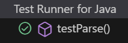
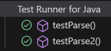

# Practica-3-AIS

Nombre de los alumnos: Raul Sanchez Benitez y Andres Muñoz Muñoz

## Ejemplo 1

**INPUT y OUTPUT**: 1 -> "1"

**EJ1. Código de test**
```java
@Test
public void testParse() {
    CalculatorParser parser = new CalculatorParser();
    assertTrue(parser.parse("1") == 1);
}
```

**EJ1. Mensaje del test añadido que NO PASA**

```log
java.lang.UnsupportedOperationException: Not implemented yet
```

**EJ1. Código mínimo para que el test pase**

Hemos hecho que devuelva 1 para que pase el test.

```java
public int parse(String expression) {
    return 1;
}
```

**EJ1. Captura de que TODOS los test PASAN**



**EJ1. Refactorización**
> No es necesaria.


<br>

## Ejemplo 2

**INPUT y OUTPUT**: 2 -> "2"

**EJ2. Código de test**
```java
@Test
public void testParse2(){
    CalculatorParser parser = new CalculatorParser();
    assertEquals(parser.parse("2"), 2);
}
```

**EJ2. Mensaje del test añadido que NO PASA**

```log
org.opentest4j.AssertionFailedError: expected: [1] but was: [2]
```

**EJ2. Código mínimo para que el test pase**

Ahora tenemos que cambiar el código y hacerlo más genérico para que pase los dos tests.

```java
public int parse(String expression) {
    return Integer.parseInt(expression);
}
```

**EJ2. Captura de que TODOS los test PASAN**



**EJ1. Refactorización**
> No es necesaria.


<br>

## Ejemplo 3

**INPUT y OUTPUT**: 2 -> "2"

**EJ2. Código de test**
```java
@Test
public void testParse2(){
    CalculatorParser parser = new CalculatorParser();
    assertEquals(parser.parse("2"), 2);
}
```

**EJ2. Mensaje del test añadido que NO PASA**

```log
org.opentest4j.AssertionFailedError: expected: [1] but was: [2]
```

**EJ2. Código mínimo para que el test pase**

Ahora tenemos que cambiar el código y hacerlo más genérico para que pase los dos tests.

```java
public int parse(String expression) {
    return Integer.parseInt(expression);
}
```

**EJ2. Captura de que TODOS los test PASAN**


**EJ1. Refactorización**
> No es necesaria.

Justificar vuestra refactorización aquí.

```java
public String convert(int number){
    return "I"; // Imaginemos que hemos refactorizado aquí
}
```
**EJ1. Captura de que TODOS los tests PASAN tras la refactorización**
> [BORRAR]  Solo si se ha realizado una refactorización

