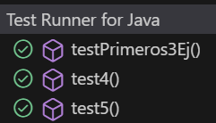
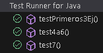
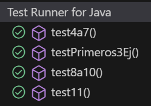
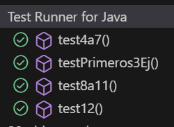
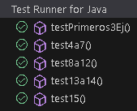
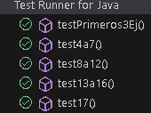
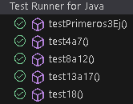
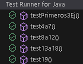

# Practica-3-AIS

Nombre de los alumnos: Raul Sanchez Benitez y Andres Muñoz Muñoz

## Ejemplo 1

**INPUT y OUTPUT**: "1" -> "1"

**EJ1. Código de test**
```java
@Test
public void testParse() {
    CalculatorParser parser = new CalculatorParser();
    assertTrue(parser.parse("1") == 1);
}
```

**EJ1. Mensaje del test añadido que NO PASA**

```log
java.lang.UnsupportedOperationException: Not implemented yet
```

**EJ1. Código mínimo para que el test pase**

Hemos hecho que devuelva 1 para que pase el test.

```java
public int parse(String expression) {
    return 1;
}
```

**EJ1. Captura de que TODOS los test PASAN**


**EJ1. Refactorización**
> No es necesaria.


<br>

## Ejemplo 2

**INPUT y OUTPUT**: "2" -> "2"

**EJ2. Código de test**
```java
@Test
public void testParse2(){
    CalculatorParser parser = new CalculatorParser();
    assertEquals(parser.parse("2"), 2);
}
```

**EJ2. Mensaje del test añadido que NO PASA**

```log
org.opentest4j.AssertionFailedError: expected: [1] but was: [2]
```

**EJ2. Código mínimo para que el test pase**

Ahora tenemos que cambiar el código y hacerlo más genérico para que pase los dos tests.

```java
public int parse(String expression) {
    return Integer.parseInt(expression);
}
```

**EJ2. Captura de que TODOS los test PASAN**


**EJ2. Refactorización**
> No es necesaria.


<br>

## Ejemplo 3

**INPUT y OUTPUT**: "3" -> "3"

**EJ3. Código de test**
```java
@Test
public void testParse3(){
    CalculatorParser parser = new CalculatorParser();
    assertEquals(parser.parse("3"), 3);
}
```

**EJ3. Mensaje del test añadido que NO PASA**

Al haber hecho el código más generico para que los dos primeros test pasen, el tercero también pasa con la implementación que ya teníamos.

**EJ3. Código mínimo para que el test pase**

Es el mismo código que en el test anterior.

```java
public int parse(String expression) {
    return Integer.parseInt(expression);
}
```

**EJ3. Captura de que TODOS los test PASAN**


**EJ3. Refactorización**
> Para finalizar bien estos tres primeros ejemplos, vamos a unificarlos en un mismo test que se asegure de que estos tres test funcionen. Todo esto con el objetivo de simplificar el código.


```java
@Test
public void testPrimeros3Ej(){
    CalculatorParser parser = new CalculatorParser();
    assertEquals(parser.parse("1"), 1);
    assertEquals(parser.parse("2"), 2);
    assertEquals(parser.parse("3"), 3);
}
```
**EJ3. Captura de que TODOS los tests PASAN tras la refactorización**


<br>

## Ejemplo 4

**INPUT y OUTPUT**: "1+1" -> "2"

**EJ4. Código de test**
```java
@Test
public void test4(){
    CalculatorParser parser = new CalculatorParser();
    assertEquals(parser.parse("1+1"), 2);
}
```

**EJ4. Mensaje del test añadido que NO PASA**

```log
java.lang.NumberFormatException: For input string: "1+1"
```

**EJ4. Código mínimo para que el test pase**

Hemos cambaido el método para que si la cadena de entrada contenga un "+", se sumen los números.

```java
public int parse(String expression) {
    if (expression.contains("+")) {
        String[] parts = expression.split("\\+");
        return Integer.parseInt(parts[0].trim()) + Integer.parseInt(parts[1].trim());
    }
    return Integer.parseInt(expression);
}
```

**EJ4. Captura de que TODOS los test PASAN**


**EJ4. Refactorización**
> Podríamos usar recursividad para simplificar el código.

```java
public int parse(String expression) {
    if (expression.contains("+")) {
        String[] parts = expression.split("\\+");
        return parse(parts[0]) + parse(parts[1]);
    }
    return Integer.parseInt(expression);
}
```
**EJ4. Captura de que TODOS los tests PASAN tras la refactorización**


<br>

## Ejemplo 5

**INPUT y OUTPUT**: "2+3" -> "5"

**EJ5. Código de test**
```java
@Test
public void test5(){
    CalculatorParser parser = new CalculatorParser();
    assertEquals(parser.parse("2+3"), 5);
}
```

**EJ5. Mensaje del test añadido que NO PASA**

El test si que pasa con la implementación anterior.

**EJ5. Código mínimo para que el test pase**

Es el mismo código que el anterior.
```java
public int parse(String expression) {
    if (expression.contains("+")) {
        String[] parts = expression.split("\\+");
        return Integer.parseInt(parts[0].trim()) + Integer.parseInt(parts[1].trim());
    }
    return Integer.parseInt(expression);
}
```

**EJ5. Captura de que TODOS los test PASAN**



**EJ5. Refactorización**
> No es necesaria.


<br>

## Ejemplo 6

**INPUT y OUTPUT**: "2+3+4" -> "9"

**EJ6. Código de test**
```java
@Test
public void test6(){
    CalculatorParser parser = new CalculatorParser();
    assertEquals(parser.parse("2+3+4"), 9);
}
```

**EJ6. Mensaje del test añadido que NO PASA**

```log
org.opentest4j.AssertionFailedError: expected: [5] but was: [9]
```

**EJ6. Código mínimo para que el test pase**

Hemos cambaido el método para que si la cadena de entrada contenga varios "+", se sumen todos los números.

```java
public int parse(String expression) {
    expression = expression.trim();
    if (expression.contains("+")) {
        String[] parts = expression.split("\\+", 2);
        return parse(parts[0]) + parse(parts[1]);
    }
    return Integer.parseInt(expression.trim());
}
```

**EJ6. Captura de que TODOS los test PASAN**


**EJ6. Refactorización**
> No es necesaria.


<br>

## Ejemplo 7

**INPUT y OUTPUT**: "1+2+3+4" -> "10"

**EJ7. Código de test**
```java
@Test
public void test7(){
    CalculatorParser parser = new CalculatorParser();
    assertEquals(parser.parse("1+2+3+4"), 10);
}
```

**EJ7. Mensaje del test añadido que NO PASA**

El test si que pasa con la implementación anterior.

**EJ7. Código mínimo para que el test pase**

Es el mismo código que el anterior.
```java
public int parse(String expression) {
    expression = expression.trim();
    if (expression.contains("+")) {
        String[] parts = expression.split("\\+", 2);
        return parse(parts[0]) + parse(parts[1]);
    }
    return Integer.parseInt(expression.trim());
}
```

**EJ7. Captura de que TODOS los test PASAN**



**EJ7. Refactorización**
> Al igual que antes, vamos a hacer una refactorización para unificar todos los tests en relación con las sumas.

```java
@Test
public void test4a7(){
    CalculatorParser parser = new CalculatorParser();
    assertEquals(parser.parse("1+1"), 2);
    assertEquals(parser.parse("2+3"), 5);
    assertEquals(parser.parse("2+3+4"), 9);
    assertEquals(parser.parse("1+2+3+4"), 10);
}
```
**EJ7. Captura de que TODOS los tests PASAN tras la refactorización**


<br>

## Ejemplo 8

**INPUT y OUTPUT**: "A" -> "Invalid expression"

**EJ8. Código de test**
```java
@Test
public void test8(){
    CalculatorParser parser = new CalculatorParser();
    IllegalArgumentException exception = assertThrows(IllegalArgumentException.class, () -> parser.parse("A"));
    assertEquals("Invalid expression", exception.getMessage());
}
```

**EJ8. Mensaje del test añadido que NO PASA**

```log
org.opentest4j.AssertionFailedError: expected: [Invalid expression] but was: [For input string: "A"]
```

**EJ8. Código mínimo para que el test pase**

Hemos cambaido el método para que al lanzar la excepción el método devuelva el mensaje de "Invalid expression" .

```java
public int parse(String expression) {
    expression = expression.trim();
    if (!expression.matches("[0-9+\\s]+")) {
        throw new IllegalArgumentException("Invalid expression");
    }
    if (expression.contains("+")) {
        String[] parts = expression.split("\\+", 2);
        return parse(parts[0]) + parse(parts[1]);
    }
    return Integer.parseInt(expression.trim());
}
```

**EJ8. Captura de que TODOS los test PASAN**


**EJ8. Refactorización**
> No es necesaria.


<br>

## Ejemplo 9

**INPUT y OUTPUT**: "B" -> "Invalid expression"

**EJ9. Código de test**
```java
@Test
public void test9(){
    CalculatorParser parser = new CalculatorParser();
    IllegalArgumentException exception = assertThrows(IllegalArgumentException.class, () -> parser.parse("B"));
    assertEquals("Invalid expression", exception.getMessage());
}
```

**EJ9. Mensaje del test añadido que NO PASA**

El test si que pasa con la implementación anterior.

**EJ9. Código mínimo para que el test pase**

Es el mismo código que el anterior.

```java
public int parse(String expression) {
    expression = expression.trim();
    if (!expression.matches("[0-9+\\s]+")) {
        throw new IllegalArgumentException("Invalid expression");
    }
    if (expression.contains("+")) {
        String[] parts = expression.split("\\+", 2);
        return parse(parts[0]) + parse(parts[1]);
    }
    return Integer.parseInt(expression.trim());
}
```

**EJ9. Captura de que TODOS los test PASAN**


**EJ9. Refactorización**
> No es necesaria.


<br>

## Ejemplo 10

**INPUT y OUTPUT**: "k" -> "Invalid expression"

**EJ10. Código de test**
```java
public void test10(){
    CalculatorParser parser = new CalculatorParser();
    IllegalArgumentException exception = assertThrows(IllegalArgumentException.class, () -> parser.parse("k"));
    assertEquals("Invalid expression", exception.getMessage());
}
```

**EJ10. Mensaje del test añadido que NO PASA**

El test si que pasa con la implementación anterior.

**EJ10. Código mínimo para que el test pase**

Es el mismo código que el anterior.

```java
public int parse(String expression) {
    expression = expression.trim();
    if (!expression.matches("[0-9+\\s]+")) {
        throw new IllegalArgumentException("Invalid expression");
    }
    if (expression.contains("+")) {
        String[] parts = expression.split("\\+", 2);
        return parse(parts[0]) + parse(parts[1]);
    }
    return Integer.parseInt(expression.trim());
}
```

**EJ10. Captura de que TODOS los test PASAN**


**EJ10. Refactorización**
> No es necesaria.


<br>

## Ejemplo 11

**INPUT y OUTPUT**: "HoLa" -> "Invalid expression"

**EJ11. Código de test**
```java
@Test
public void test11(){
    CalculatorParser parser = new CalculatorParser();
    IllegalArgumentException exception = assertThrows(IllegalArgumentException.class, () -> parser.parse("HoLa"));
    assertEquals("Invalid expression", exception.getMessage());
}
```

**EJ11. Mensaje del test añadido que NO PASA**

El test si que pasa con la implementación anterior.

**EJ11. Código mínimo para que el test pase**

Es el mismo código que el anterior.

```java
public int parse(String expression) {
    expression = expression.trim();
    if (!expression.matches("[0-9+\\s]+")) {
        throw new IllegalArgumentException("Invalid expression");
    }
    if (expression.contains("+")) {
        String[] parts = expression.split("\\+", 2);
        return parse(parts[0]) + parse(parts[1]);
    }
    return Integer.parseInt(expression.trim());
}
```

**EJ11. Captura de que TODOS los test PASAN**



**EJ11. Refactorización**
> No es necesaria.


<br>

## Ejemplo 12

**INPUT y OUTPUT**: "1 + A" -> "Invalid expression"

**EJ12. Código de test**
```java
@Test
public void test12(){
    CalculatorParser parser = new CalculatorParser();
    IllegalArgumentException exception = assertThrows(IllegalArgumentException.class, () -> parser.parse("1 + A"));
    assertEquals("Invalid expression", exception.getMessage());
}
```

**EJ12. Mensaje del test añadido que NO PASA**

El test si que pasa con la implementación anterior.

**EJ12. Código mínimo para que el test pase**

Es el mismo código que el anterior.

```java
public int parse(String expression) {
    expression = expression.trim();
    if (!expression.matches("[0-9+\\s]+")) {
        throw new IllegalArgumentException("Invalid expression");
    }
    if (expression.contains("+")) {
        String[] parts = expression.split("\\+", 2);
        return parse(parts[0]) + parse(parts[1]);
    }
    return Integer.parseInt(expression.trim());
}
```

**EJ12. Captura de que TODOS los test PASAN**



**EJ12. Refactorización**
> Como en los casos anteriores, vamos a refactorizar para unificar todos los tests, pero esta vez, vamos a hacer dos refactorizaciones, una que los unifica y otra que usa un método auxiliar para simplificar el código. 

```java
@Test
public void test8a12(){
    CalculatorParser parser = new CalculatorParser();
    IllegalArgumentException exception1 = assertThrows(IllegalArgumentException.class, () -> parser.parse("A"));
    assertEquals("Invalid expression", exception1.getMessage());
    IllegalArgumentException exception2 = assertThrows(IllegalArgumentException.class, () -> parser.parse("B"));
    assertEquals("Invalid expression", exception2.getMessage());
    IllegalArgumentException exception3 = assertThrows(IllegalArgumentException.class, () -> parser.parse("k"));
    assertEquals("Invalid expression", exception3.getMessage());
    IllegalArgumentException exception4 = assertThrows(IllegalArgumentException.class, () -> parser.parse("HoLa"));
    assertEquals("Invalid expression", exception4.getMessage());
    IllegalArgumentException exception5 = assertThrows(IllegalArgumentException.class, () -> parser.parse("1 + A"));
    assertEquals("Invalid expression", exception5.getMessage());
}
```
Ahora que ya hemos unificado todos los tests, vamos a usar un método auxiliar para simplificar el test.
```java
public String aTAux(String expression){
    CalculatorParser parser = new CalculatorParser();
    IllegalArgumentException result = assertThrows(IllegalArgumentException.class, () -> parser.parse(expression));
    return result.getMessage();
}
@Test
public void test8a12(){
    assertEquals("Invalid expression", aTAux("A"));
    assertEquals("Invalid expression", aTAux("B"));
    assertEquals("Invalid expression", aTAux("k"));
    assertEquals("Invalid expression", aTAux("HoLa"));
    assertEquals("Invalid expression", aTAux("1 + A"));
}
```

**EJ12. Captura de que TODOS los tests PASAN tras la refactorización**


<br>

## Ejemplo 13

**INPUT y OUTPUT**: "5-3" -> "2"

**EJ13. Código de test**
```java
@Test
public void test13(){
    CalculatorParser parser = new CalculatorParser();
    assertEquals(parser.parse("5-3"), 2);
}
```

**EJ13. Mensaje del test añadido que NO PASA**

```log
java.lang.IllegalArgumentException: Invalid expression
```

**EJ13. Código mínimo para que el test pase**

Para que se el test pase, tenemos que modificar el primer if, además de añadir la funcionaldad de la resta.

```java
public int parse(String expression) {
    expression = expression.trim();
    if (!expression.matches("[0-9+\\-\\s]+")) {
        throw new IllegalArgumentException("Invalid expression");
    }
    if (expression.contains("+")) {
        String[] parts = expression.split("\\+", 2);
        return parse(parts[0]) + parse(parts[1]);
    }
    if (expression.contains("-")) {
        String[] parts = expression.split("-", 2);
        return parse(parts[0]) - parse(parts[1]);
    }
    return Integer.parseInt(expression.trim());
}
```

**EJ13. Captura de que TODOS los test PASAN**


**EJ13. Refactorización**
> No es necesaria.


<br>

## Ejemplo 14

**INPUT y OUTPUT**: "1-2" -> "-1"

**EJ14. Código de test**
```java
@Test
public void test14(){
    CalculatorParser parser = new CalculatorParser();
    assertEquals(parser.parse("1-2"), -1);
}
```

**EJ14. Mensaje del test añadido que NO PASA**

Si que pasa el test.

**EJ14. Código mínimo para que el test pase**

El test si que pasa con la implementación anterior.

```java
public int parse(String expression) {
    expression = expression.trim();
    if (!expression.matches("[0-9+\\-\\s]+")) {
        throw new IllegalArgumentException("Invalid expression");
    }
    if (expression.contains("+")) {
        String[] parts = expression.split("\\+", 2);
        return parse(parts[0]) + parse(parts[1]);
    }
    if (expression.contains("-")) {
        String[] parts = expression.split("-", 2);
        return parse(parts[0]) - parse(parts[1]);
    }
    return Integer.parseInt(expression.trim());
}
```

**EJ14. Captura de que TODOS los test PASAN**


**EJ14. Refactorización**
> No es necesaria.


<br>

## Ejemplo 15

**INPUT y OUTPUT**: "7-2-1" -> "4"

**EJ15. Código de test**
```java
@Test
public void test15(){
    CalculatorParser parser = new CalculatorParser();
    assertEquals(parser.parse("7-2-1"), 4);
}
```

**EJ15. Mensaje del test añadido que NO PASA**

```log
org.opentest4j.AssertionFailedError: expected: [6] but was: [4]
```

**EJ15. Código mínimo para que el test pase**

Para que este test pase, primero tenemos que analizar la causa del error. Para empezar, estabamos usando un enfoque de divide y vencerás para la resolución de todos los casos, pero en la resta no nos sirve debido a que con la implementación que tenemos se van restando los números, es decir, al hacer 2+3+4, con nuestro enfoque se haría 2+(3+4), lo cual al ser una suma no afectarían los paréntesis, por lo que la suma si que era correcta, pero al enfrentarnos a la resta los paréntesis si que afectan, por ejemplo, al hacer 7-2-1, con nuestro enfoque sería 7-(2-1), lo que sería como hacer 7-1 = 6 != 4 , entonces tenemos que cambiar el enfoque de la resta con más de dos valores. Para ello vamos a hacer que para realizar las restas, se haga de izquierda a derecha, de esta manera, al hacer 7-2-1, haremos (7-2)-1 que dará 4.

```java
public int parse(String expression) {
    expression = expression.trim();
    if (!expression.matches("[0-9+\\-\\s]+")) {
        throw new IllegalArgumentException("Invalid expression");
    }
    if (expression.contains("+")) {
        String[] parts = expression.split("\\+", 2);
        return parse(parts[0]) + parse(parts[1]);
    }
    if (expression.contains("-")) {
        int lastMinus = expression.lastIndexOf('-');
        if (lastMinus > 0) {
            String left = expression.substring(0, lastMinus);
            String right = expression.substring(lastMinus + 1);
            return parse(left) - parse(right);
        }
    }
    return Integer.parseInt(expression.trim());
}
```

**EJ15. Captura de que TODOS los test PASAN**



**EJ15. Refactorización**
> No es necesaria.


<br>

## Ejemplo 16

**INPUT y OUTPUT**: "9-5-3-1" -> "0"

**EJ16. Código de test**
```java
@Test
public void test16(){
    CalculatorParser parser = new CalculatorParser();
    assertEquals(parser.parse("9-5-3-1"), 0);
}
```

**EJ16. Mensaje del test añadido que NO PASA**

Si que pasa el test.

**EJ16. Código mínimo para que el test pase**

El test si que pasa con la implementación anterior.

```java
public int parse(String expression) {
    expression = expression.trim();
    if (!expression.matches("[0-9+\\-\\s]+")) {
        throw new IllegalArgumentException("Invalid expression");
    }
    if (expression.contains("+")) {
        String[] parts = expression.split("\\+", 2);
        return parse(parts[0]) + parse(parts[1]);
    }
    if (expression.contains("-")) {
        int lastMinus = expression.lastIndexOf('-');
        if (lastMinus > 0) {
            String left = expression.substring(0, lastMinus);
            String right = expression.substring(lastMinus + 1);
            return parse(left) - parse(right);
        }
    }
    return Integer.parseInt(expression.trim());
}
```

**EJ16. Captura de que TODOS los test PASAN**


**EJ16. Refactorización**
> No es necesaria.


<br>

## Ejemplo 17

**INPUT y OUTPUT**: "7+1-5" -> "3"

**EJ17. Código de test**
```java
@Test
public void test17(){
    CalculatorParser parser = new CalculatorParser();
    assertEquals(parser.parse("7+1-5"), 3);
}
```

**EJ17. Mensaje del test añadido que NO PASA**

Si que pasa el test.

**EJ17. Código mínimo para que el test pase**

El test si que pasa con la implementación anterior.

```java
public int parse(String expression) {
    expression = expression.trim();
    if (!expression.matches("[0-9+\\-\\s]+")) {
        throw new IllegalArgumentException("Invalid expression");
    }
    if (expression.contains("+")) {
        String[] parts = expression.split("\\+", 2);
        return parse(parts[0]) + parse(parts[1]);
    }
    if (expression.contains("-")) {
        int lastMinus = expression.lastIndexOf('-');
        if (lastMinus > 0) {
            String left = expression.substring(0, lastMinus);
            String right = expression.substring(lastMinus + 1);
            return parse(left) - parse(right);
        }
    }
    return Integer.parseInt(expression.trim());
}
```

**EJ17. Captura de que TODOS los test PASAN**



**EJ17. Refactorización**
> No es necesaria.


<br>

## Ejemplo 18

**INPUT y OUTPUT**: "7+1-5" -> "3"

**EJ18. Código de test**
```java
@Test
public void test18(){
    CalculatorParser parser = new CalculatorParser();
    assertEquals(parser.parse("9-5+4"), 8);
}
```

**EJ18. Mensaje del test añadido que NO PASA**

Si que pasa el test.

**EJ18. Código mínimo para que el test pase**

El test si que pasa con la implementación anterior.

```java
public int parse(String expression) {
    expression = expression.trim();
    if (!expression.matches("[0-9+\\-\\s]+")) {
        throw new IllegalArgumentException("Invalid expression");
    }
    if (expression.contains("+")) {
        String[] parts = expression.split("\\+", 2);
        return parse(parts[0]) + parse(parts[1]);
    }
    if (expression.contains("-")) {
        int lastMinus = expression.lastIndexOf('-');
        if (lastMinus > 0) {
            String left = expression.substring(0, lastMinus);
            String right = expression.substring(lastMinus + 1);
            return parse(left) - parse(right);
        }
    }
    return Integer.parseInt(expression.trim());
}
```

**EJ18. Captura de que TODOS los test PASAN**



**EJ18. Refactorización**
> No es necesaria.


<br>

## Ejemplo 19

**INPUT y OUTPUT**: "9+1-6-2" -> "2"

**EJ19. Código de test**
```java
@Test
public void test19(){
    CalculatorParser parser = new CalculatorParser();
    assertEquals(parser.parse("9+1-6-2"), 2);
}
```

**EJ19. Mensaje del test añadido que NO PASA**

Si que pasa el test.

**EJ19. Código mínimo para que el test pase**

El test si que pasa con la implementación anterior.

```java
public int parse(String expression) {
    expression = expression.trim();
    if (!expression.matches("[0-9+\\-\\s]+")) {
        throw new IllegalArgumentException("Invalid expression");
    }
    if (expression.contains("+")) {
        String[] parts = expression.split("\\+", 2);
        return parse(parts[0]) + parse(parts[1]);
    }
    if (expression.contains("-")) {
        int lastMinus = expression.lastIndexOf('-');
        if (lastMinus > 0) {
            String left = expression.substring(0, lastMinus);
            String right = expression.substring(lastMinus + 1);
            return parse(left) - parse(right);
        }
    }
    return Integer.parseInt(expression.trim());
}
```

**EJ19. Captura de que TODOS los test PASAN**



**EJ19. Refactorización**
> No es necesaria.


<br>

## Ejemplo 1

**INPUT y OUTPUT**: "1" -> "1"

**EJ1. Código de test**
```java
@Test
public void test4(){
    CalculatorParser parser = new CalculatorParser();
    assertEquals(parser.parse("1+1"), 2);
}
```

**EJ1. Mensaje del test añadido que NO PASA**

```log
java.lang.NumberFormatException: For input string: "1+1"
```

**EJ1. Código mínimo para que el test pase**

Hemos cambaido el método para que si la cadena de entrada contenga un "+", se sumen los números.

```java
public int parse(String expression) {
    if (expression.contains("+")) {
        String[] parts = expression.split("\\+");
        return Integer.parseInt(parts[0].trim()) + Integer.parseInt(parts[1].trim());
    }
    return Integer.parseInt(expression);
}
```

**EJ1. Captura de que TODOS los test PASAN**


**EJ1. Refactorización**
> No es necesaria.

Justificar vuestra refactorización aquí.

```java
public String convert(int number){
    return "I"; // Imaginemos que hemos refactorizado aquí
}
```
**EJ1. Captura de que TODOS los tests PASAN tras la refactorización**
> [BORRAR]  Solo si se ha realizado una refactorización


